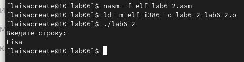
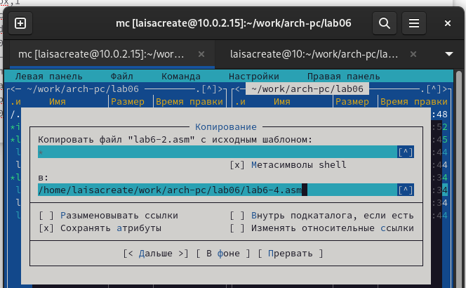

---
## Front matter
title: "Шаблон отчёта по лабораторной работе №6"
subtitle: "НММбд-03-22"
author: "Толстых Максим Алексеевич"

## Generic otions
lang: ru-RU
toc-title: "Содержание"

## Bibliography
bibliography: bib/cite.bib
csl: pandoc/csl/gost-r-7-0-5-2008-numeric.csl

## Pdf output format
toc: true # Table of contents
toc-depth: 2
lof: true # List of figures
lot: true # List of tables
fontsize: 12pt
linestretch: 1.5
papersize: a4
documentclass: scrreprt
## I18n polyglossia
polyglossia-lang:
  name: russian
  options:
	- spelling=modern
	- babelshorthands=true
polyglossia-otherlangs:
  name: english
## I18n babel
babel-lang: russian
babel-otherlangs: english
## Fonts
mainfont: PT Serif
romanfont: PT Serif
sansfont: PT Sans
monofont: PT Mono
mainfontoptions: Ligatures=TeX
romanfontoptions: Ligatures=TeX
sansfontoptions: Ligatures=TeX,Scale=MatchLowercase
monofontoptions: Scale=MatchLowercase,Scale=0.9
## Biblatex
biblatex: true
biblio-style: "gost-numeric"
biblatexoptions:
  - parentracker=true
  - backend=biber
  - hyperref=auto
  - language=auto
  - autolang=other*
  - citestyle=gost-numeric
## Pandoc-crossref LaTeX customization
figureTitle: "Рис."
tableTitle: "Таблица"
listingTitle: "Листинг"
lofTitle: "Список иллюстраций"
lotTitle: "Список таблиц"
lolTitle: "Листинги"
## Misc options
indent: true
header-includes:
  - \usepackage{indentfirst}
  - \usepackage{float} # keep figures where there are in the text
  - \floatplacement{figure}{H} # keep figures where there are in the text
---

# Цель работы

Приобретение практических навыков работы в Midnight Commander. Освоение
инструкций языка ассемблера mov и int.

# Задание

Создать исполняющие файлы из файлов ассемблера, реализующие ввод и
вывод текста.

# Выполнение лабораторной работы

Открываем Midnight Commander (рис. 1)

{ #fig:001 width=70% }

Пользуясь клавишами "стрелочка вверх", "стрелочка вниз" и Enter перешли в каталог arch-pc, созданный
при выполнении лабораторной работы №5. (рис. 2)

{ #fig:002 width=70% }

С помощью функциональной клавиши F7 создали папку lab06 и перешли в
созданный каталог. (рис. 3)

{ #fig:003 width=70% }

Пользуясь строкой ввода и командой touch создайте файл lab6-1.asm. (рис. 4),
(рис. 5)

{ #fig:004 width=70% }

{ #fig:005 width=70% }

С помощью функциональной клавиши F4 откройте файл lab6-1.asm для редактирования во встроенном редакторе. (рис. 6)

{ #fig:006 width=70% }

Ввели текст программы из листинга 6.1, сохранили изменения и закрыли файл.
(рис. 7)

{ #fig:007 width=70% }

С помощью функциональной клавиши F3 открыли файл lab6-1.asm для просмотра. Убедились, что файл содержит текст программы. (рис. 8)

{ #fig:008 width=70% }

Оттранслировали текст программы lab6-1.asm в объектный файл. Выполнили
компоновку объектного файла и запустили получившийся исполняемый файл.
Программа вывела строку ‘Введите строку:’ и ожидала ввода с клавиатуры. На
запрос ввели Lisa. (рис. 9)

{ #fig:009 width=70% }

Скачали файл in_out.asm со страницы курса в ТУИС. (рис. 10)

{ #fig:010 width=70% }

Подключаемый файл in_out.asm должен лежать в том же каталоге, что и файл с
программой, в которой он используется. В одной из панелей mc открыли каталог
с файлом lab6-1.asm. В другой панели каталог со скаченным файлом in_out.asm.
Скопировали файл in_out.asm в каталог с файлом lab6-1.asm с помощью функциональной клавиши F5.(рис. 11)

{ #fig:011 width=70% }

С помощью функциональной клавиши F6 создали копию файла lab6- 1.asm с
именем lab6-2.asm. Выделили файл lab6-1.asm, нажали клавишу F6 , ввели имя
файла lab6-2.asm и нажали клавишу Enter. (рис. 12)

{ #fig:012 width=70% }

Исправили текст программы в файле lab6-2.asm с использование подпрограмм
из внешнего файла in_out.asm (использовали подпрограммы sprintLF, sread и
quit) в соответствии с листингом 6.2. Создали исполняемый файл и проверьте
его работу. (рис. 13), (рис. 14)

{ #fig:013 width=70% }

{ #fig:014 width=70% }

В файле lab6-2.asm заменили подпрограмму sprintLF на sprint. Создали исполняемый файл и проверили его работу. При замене подпрограмм пропадает
перенос строки перед вводом текста. (рис. 15), (рис. 16)

{ #fig:015 width=70% }
{ #fig:016 width=70% }

# Задание для самостоятельной работы

Создали копию файла lab6-1.asm. Внесли изменения в программу (без использования внешнего файла in_out.asm), так чтобы она работала по следующему
алгоритму: 1. вывести приглашение типа “Введите строку:”; 2. ввести строку с
клавиатуры; 3. вывести введённую строку на экран.
(рис. 17), (рис. 18)

{ #fig:017 width=70% }

{ #fig:018 width=70% }

Получили исполняемый файл и проверили его работу. На приглашение ввести
строку ввели свою фамилию. (рис. 19)

{ #fig:019 width=70% }

Создали копию файла lab6-2.asm. Исправили текст программы с использованием подпрограмм из внешнего файла in_out.asm, так чтобы она работала
по следующему алгоритму: 1. вывести приглашение типа “Введите строку:”; 2.
ввести строку с клавиатуры; 3. вывести введённую строку на экран.
(рис. 20), (рис. 21)

{ #fig:020 width=70% }

{ #fig:021 width=70% }

Создали исполняемый файл и проверили его работу. (рис. 22)

{ #fig:022 width=70% }

# Выводы

В ходе выполненя лобороторной работы были приобретены практическиы
навыки работы в Midnight Commander и освоены инструкции языка ассемблера
mov и int.

