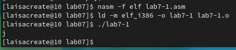

---
## Front matter
title: "Лабораторная работа №7"
subtitle: "Арифметические операции в NASM"
author: "Попова Елизавета Сергеевна"

## Generic otions
lang: ru-RU
toc-title: "Содержание"

## Bibliography
bibliography: bib/cite.bib
csl: pandoc/csl/gost-r-7-0-5-2008-numeric.csl

## Pdf output format
toc: true # Table of contents
toc-depth: 2
lof: true # List of figures
lot: true # List of tables
fontsize: 12pt
linestretch: 1.5
papersize: a4
documentclass: scrreprt
## I18n polyglossia
polyglossia-lang:
  name: russian
  options:
	- spelling=modern
	- babelshorthands=true
polyglossia-otherlangs:
  name: english
## I18n babel
babel-lang: russian
babel-otherlangs: english
## Fonts
mainfont: PT Serif
romanfont: PT Serif
sansfont: PT Sans
monofont: PT Mono
mainfontoptions: Ligatures=TeX
romanfontoptions: Ligatures=TeX
sansfontoptions: Ligatures=TeX,Scale=MatchLowercase
monofontoptions: Scale=MatchLowercase,Scale=0.9
## Biblatex
biblatex: true
biblio-style: "gost-numeric"
biblatexoptions:
  - parentracker=true
  - backend=biber
  - hyperref=auto
  - language=auto
  - autolang=other*
  - citestyle=gost-numeric
## Pandoc-crossref LaTeX customization
figureTitle: "Рис."
lofTitle: "Список иллюстраций"
## Misc options
indent: true
header-includes:
  - \usepackage{indentfirst}
  - \usepackage{float} # keep figures where there are in the text
  - \floatplacement{figure}{H} # keep figures where there are in the text
---

# Цель работы

Освоение арифметических инструкций языка ассемблера NASM.

# Выполнение лабораторной работы

 1) Я создала каталог lab07 и внутри создал файл lab7-1.asm.

{ #fig:001 width=70% }

2) В файл lab7-1.asm я ввела нужный текст, создала файл и проверила его.
Программа вывела j.

{ #fig:002 width=70% }

{ #fig:003 width=70% }

3) Я изменила текст программы. Когда я сделала программу и запустила ее, она
вывела невидимый символ, как и должна была.

{ #fig:004 width=70% }

{ #fig:005 width=70% }

4) Я создала файл lab7-2.asm и ввел в него текст программы.

{ #fig:006 width=70% }

{ #fig:007 width=70% }

5) Cоздала исполняемый файл и запустил его. Как и предполагалось, он вывел
число 106.

{ #fig:008 width=70% }

6) Я изменила текст программы lab7-2 и запустила ее. Она вывела число 10, как
и должна была.

{ #fig:009 width=70% }

7) Я заменила функцию iprintLF на iprint. Проверила файл и результат отличался
в выводе данных. Когда используется команда iprintLF, результат выводится
на следующей строке, а при использовании команды iprint на этой же строке.

{ #fig:010 width=70% }

{ #fig:011 width=70% }

8) Я создала файл lab7-3.asm и ввел текст программы. Запустила и проверила ее
работу.

{ #fig:012 width=70% }

{ #fig:013 width=70% }

9) Я изменила программу для примера F(x) = (4*6+2)/5. Запустила ее и проверила.

{ #fig:014 width=70% }

{ #fig:015 width=70% }

10) Я создала файл variant.asm и ввела туда нужный текст.

{ #fig:016 width=70% }

11) Я ввела в эту программу свой студенческий билет. Он вывел
ответ 15. Я проверила это аналитически, ответ совпал.

{ #fig:017 width=70% }

# Вопросы

1) Какие строки листинга 7.4 отвечают за вывод на экран сообщения ‘Ваш
вариант:’? Ответ: mov eax,msg call sprintLF

2) Для чего используется следующие инструкции? nasm mov ecx, x mov edx, 80
call sread. Ответ: Эти инструкции используются для ввода переменной Х с клавиатуры и
сохранения введенных данных.

3) Для чего используется инструкция “call atoi”? Ответ: Эта инструкция используется для преобразования кода переменной ASCII в число.

4) Какие строки листинга 7.4 отвечают за вычисления варианта? Ответ: mov ebx,20 div ebx inc edx

5)В какой регистр записывается остаток от деления при выполнении
инструкции “div ebx”? Ответ: В регистре ebx.

6) Для чего используется инструкция “inc edx”? Ответ: Для увеличения значения edx на 1.

7)Какие строки листинга 7.4 отвечают за вывод на экран результата
вычислений? Ответ: mov eax,edx call iprintLF

# Самостоятельная работа

Я написала программу которая будет решать выражение и выводить ответ при
введенных х. Так как в 11 пункте мне выдало 15 вариант, то программу я писала
для выражения F(x) = (5+x)^2-3. Я вводила значения переменных 5 и 1, ответы
верны.

{ #fig:018 width=70% }

{ #fig:019 width=70% }

# Выводы

Я освоила арифметические инструкции языка ассемблер NASM.

