---
## Front matter
title: "Отчет по лабораторной работе №8"
subtitle: "Команды безусловного и условного переходов в Nasm. Программирование ветвлений."
author: "Попова Елизавета Сергеевна"

## Generic otions
lang: ru-RU
toc-title: "Содержание"

## Bibliography
bibliography: bib/cite.bib
csl: pandoc/csl/gost-r-7-0-5-2008-numeric.csl

## Pdf output format
toc: true # Table of contents
toc-depth: 2
lof: true # List of figures
lot: true # List of tables
fontsize: 12pt
linestretch: 1.5
papersize: a4
documentclass: scrreprt
## I18n polyglossia
polyglossia-lang:
  name: russian
  options:
	- spelling=modern
	- babelshorthands=true
polyglossia-otherlangs:
  name: english
## I18n babel
babel-lang: russian
babel-otherlangs: english
## Fonts
mainfont: PT Serif
romanfont: PT Serif
sansfont: PT Sans
monofont: PT Mono
mainfontoptions: Ligatures=TeX
romanfontoptions: Ligatures=TeX
sansfontoptions: Ligatures=TeX,Scale=MatchLowercase
monofontoptions: Scale=MatchLowercase,Scale=0.9
## Biblatex
biblatex: true
biblio-style: "gost-numeric"
biblatexoptions:
  - parentracker=true
  - backend=biber
  - hyperref=auto
  - language=auto
  - autolang=other*
  - citestyle=gost-numeric
## Pandoc-crossref LaTeX customization
figureTitle: "Рис."
tableTitle: "Таблица"
listingTitle: "Листинг"
lofTitle: "Список иллюстраций"
lotTitle: "Список таблиц"
lolTitle: "Листинги"
## Misc options
indent: true
header-includes:
  - \usepackage{indentfirst}
  - \usepackage{float} # keep figures where there are in the text
  - \floatplacement{figure}{H} # keep figures where there are in the text
---

# Цель работы

Изучение команд условного и безусловного переходов. Приобретение навыков
написания программ с использованием переходов. Знакомство с назначением и
структурой файла листинга.

# Выполнение лабораторной работы

1) Я создала каталог lab08, где создала файл lab8-1.asm

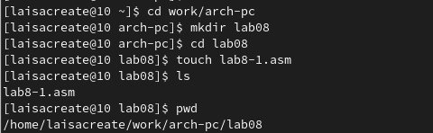{ #fig:001 width=70% }

2) Я ввела нужный текст программы в файл и затем запустила его.

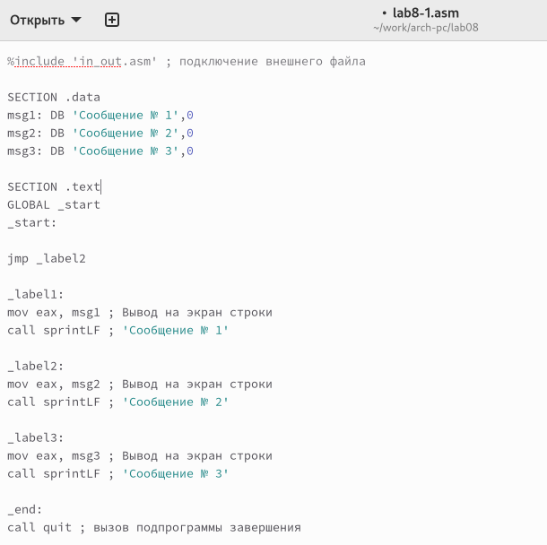{ #fig:002 width=70% }

3) Я создала исполняемый файл и запустила его. Результат работы программы верный.

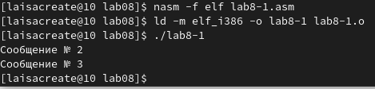{ #fig:003 width=70% }

4) Я изменила текст программы так, чтобы выводился нужный ответ и снова создала исполняемый файл.

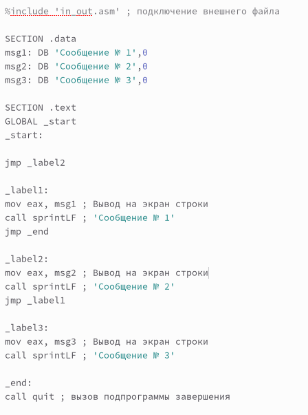{ #fig:004 width=70% }

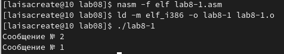{ #fig:005 width=70% }

5) Я изменила текст программы так, чтобы сперва выводилось сообщение №3, потом сообщение №2 и в конце сообщение №1.

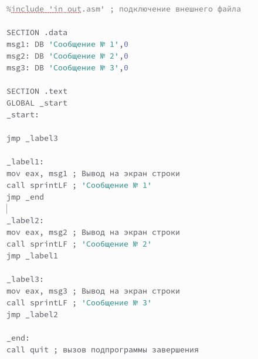{ #fig:006 width=70% }

6) Я запустила программу и проверила корректность результата.

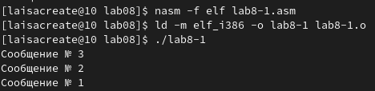{ #fig:007 width=70% }

7) Я создала файл lab8-2.asm и написала нужный текст программы.

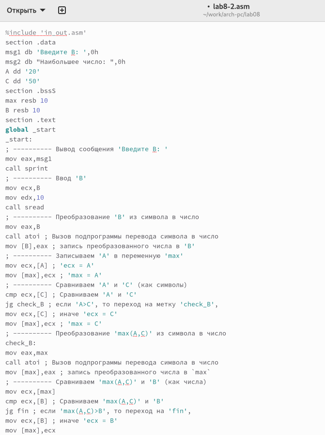{ #fig:008 width=70% }

8) Я ввела несколько различных чисел для проверки программы.

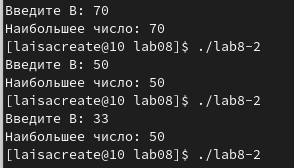{ #fig:009 width=70% }

9) Я создала файл листинга lab8-2.lst и открыла его.

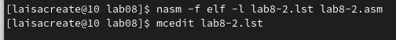{ #fig:010 width=70% }

10) Я проанализировала файл и поняла как он работает, а также какие значения выводит.

11) Данная строка находится на 21 месте. Она имеет адрес 00000101, ее машинный код - B8[0A000000], исходный текст программы - mov eax, B; исходный код означает, что в регистр еах мы вносим значение переменной В.

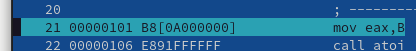{ #fig:011 width=70% }

12) Данная строка находится на 35 месте. Она имеет адрес 00000135, ее машинный код - E862FFFFFF, исходный текст программы - call atoi; исходный код означает, что символ, содержащийся в строке выше переводится в число.

{ #fig:012 width=70% }

13) Данная строка находится на 47 месте. Она имеет адрес 00000163, ее машинный код - А1[00000000], исходный текст программы - mov eax,[max]; исходный код означает, что число, которое хранилось в переменной max записывается в регистр еах.

{ #fig:013 width=70% }

14) В строке mov eсx,[B] я убрала [B] и попробовала создать файл. Выдало ошибку, так как для программы нужно два операнда.

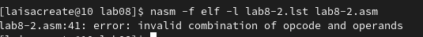{ #fig:014 width=70% }

15) В файле листинга также показывается ошибка.

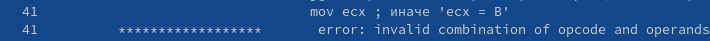{ #fig:015 width=70% }

# Самостоятельная работа

1) Я написала программу для нахождения меньшего из трех чисел. Для 15 варианта нужны следующие значения: 32, 6, 54. Программа вывела правильное значение - 6.

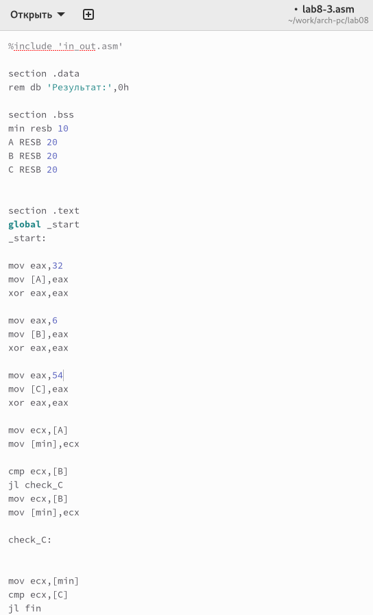{ #fig:016 width=70% }

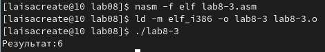{ #fig:017 width=70% }

2) Я написала программу для вычисления значения выражения при введенных Х и А. Мой вариант 15: 
(а + 10, х < a
x + 10, x >= a)

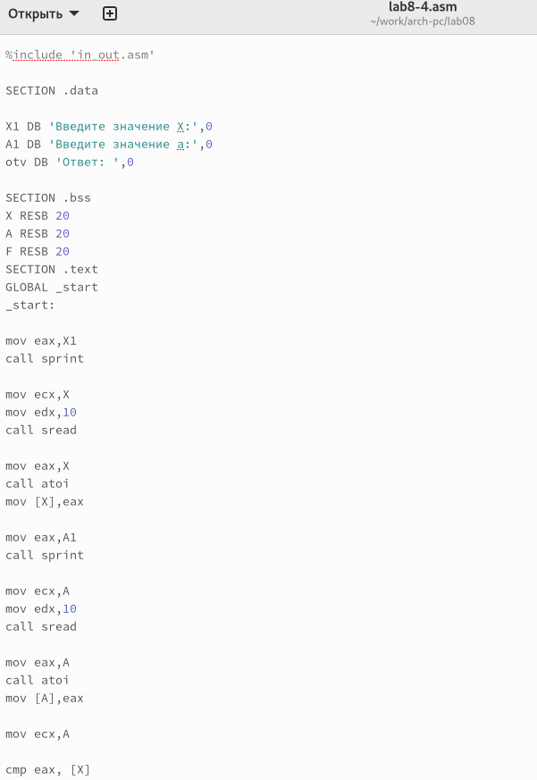{ #fig:018 width=70% }

3) Результаты также оказались верными.

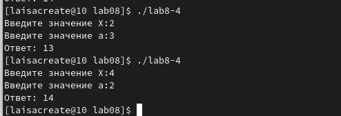{ #fig:019 width=70% }

# Выводы

Я изучила команды условного и безусловного перехода, а также научилась писать программы с переходами.

# Список литературы{.unnumbered}

::: {#refs}
:::
