---
## Front matter
title: "Отчет по лабораторной работе №9"
subtitle: "Компьютерные науки и технология программирования"
author: "Попова Елизавета Сергеевна"

## Generic otions
lang: ru-RU
toc-title: "Содержание"

## Bibliography
bibliography: bib/cite.bib
csl: pandoc/csl/gost-r-7-0-5-2008-numeric.csl

## Pdf output format
toc: true # Table of contents
toc-depth: 2
lof: true # List of figures
lot: true # List of tables
fontsize: 12pt
linestretch: 1.5
papersize: a4
documentclass: scrreprt
## I18n polyglossia
polyglossia-lang:
  name: russian
  options:
	- spelling=modern
	- babelshorthands=true
polyglossia-otherlangs:
  name: english
## I18n babel
babel-lang: russian
babel-otherlangs: english
## Fonts
mainfont: PT Serif
romanfont: PT Serif
sansfont: PT Sans
monofont: PT Mono
mainfontoptions: Ligatures=TeX
romanfontoptions: Ligatures=TeX
sansfontoptions: Ligatures=TeX,Scale=MatchLowercase
monofontoptions: Scale=MatchLowercase,Scale=0.9
## Biblatex
biblatex: true
biblio-style: "gost-numeric"
biblatexoptions:
  - parentracker=true
  - backend=biber
  - hyperref=auto
  - language=auto
  - autolang=other*
  - citestyle=gost-numeric
## Pandoc-crossref LaTeX customization
figureTitle: "Рис."
tableTitle: "Таблица"
listingTitle: "Листинг"
lofTitle: "Список иллюстраций"
lotTitle: "Список таблиц"
lolTitle: "Листинги"
## Misc options
indent: true
header-includes:
  - \usepackage{indentfirst}
  - \usepackage{float} # keep figures where there are in the text
  - \floatplacement{figure}{H} # keep figures where there are in the text
---

# Цель работы

Приобрести навыки написания программ с использованием циклов и обработкой аргументов командной строки.

# Выполнение лабораторной работы

Создаём каталог для программ лабораторных №9, переходим в него и создаём файл ‘lab9-1.asm’. Открываем его. (рис. [-@fig:001])

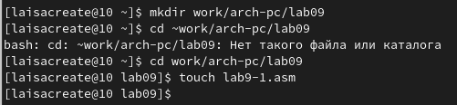{ #fig:001 width=70% }

Вводим текст программы. (рис. [-@fig:002])

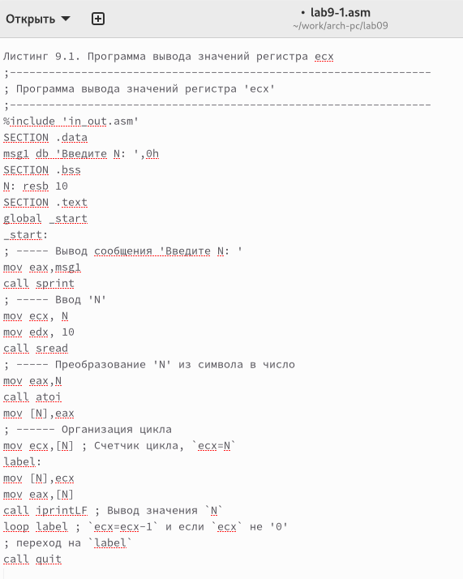{ #fig:002 width=70% }

Создаём исполняемый файл и проверяем работу. (рис. [-@fig:003])

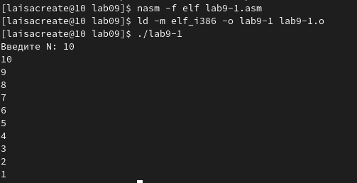{ #fig:003 width=70% }

Изменим текст программы lab9-1.asm. (рис. [-@fig:004])

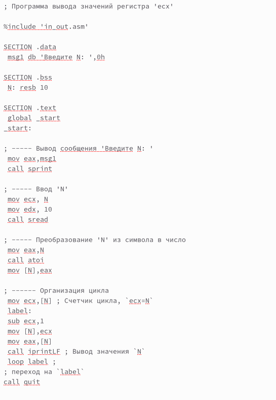{ #fig:004 width=70% }

Видим, что данный алгоритм выводит нечетные числа, которые меньше, чем N. Получим всего N/2 значений.

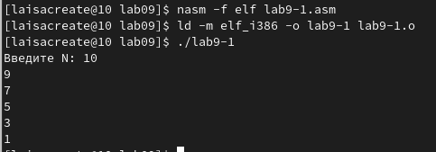{ #fig:005 width=70% }

Вновь изменим код программы lab9-1.asm. (рис. [-@fig:006])

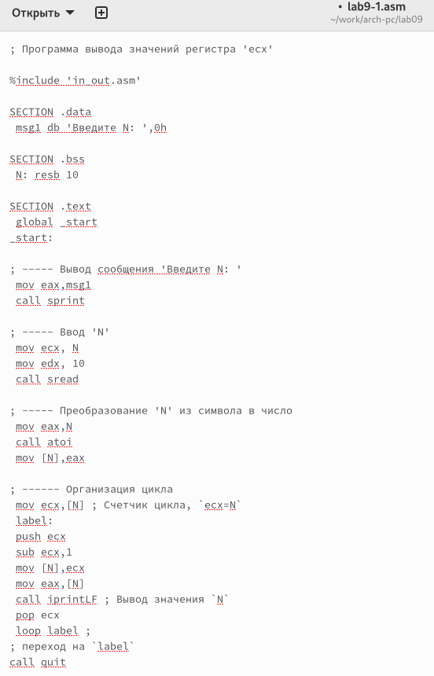{ #fig:006 width=70% }

Проверим работу файла. Он работает верно. Всего выведено N значений. (рис. [-@fig:007])

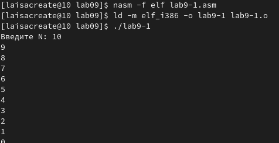{ #fig:007 width=70% }

Создадим файл ‘lab9-2.asm’. (рис. [-@fig:008])

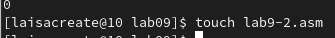{ #fig:008 width=70% }

Введем нужный текст в файл lab9-2.asm. (рис. [-@fig:009])

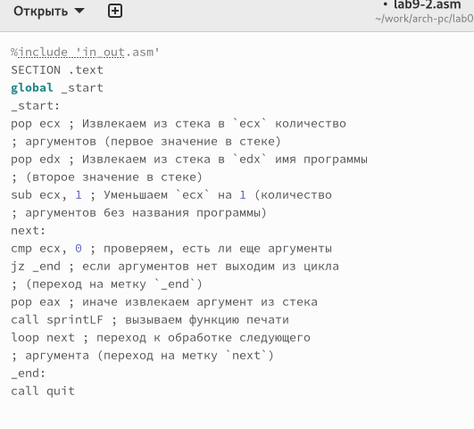{ #fig:009 width=70% }

Запустим программу lab9-2.asm и проверим работу. (рис. [-@fig:010])

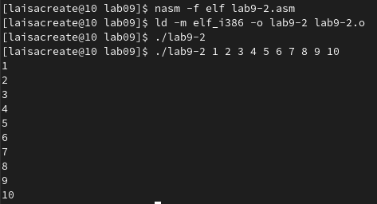{ #fig:010 width=70% }

Создадим файл lab9-3.asm и введем текст программы. (рис. [-@fig:011]), (рис. [-@fig:012])

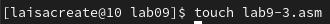{ #fig:011 width=70% }

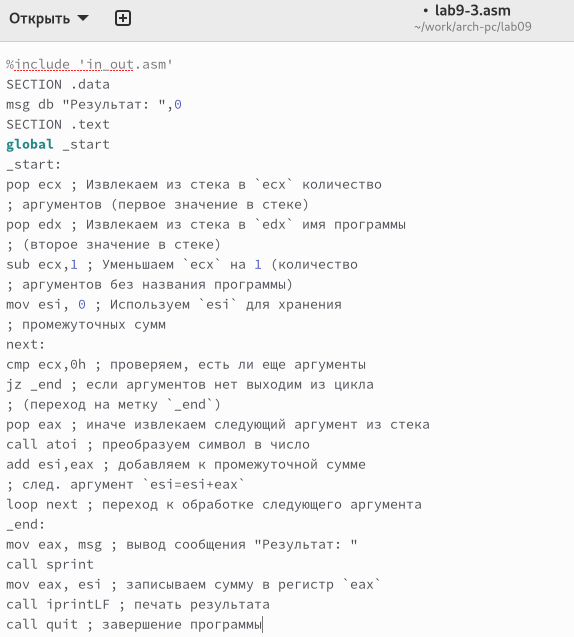{ #fig:012 width=70% }

Проверим работу файла. Программа выдает верный результат. (рис. [-@fig:013])

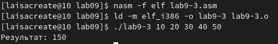{ #fig:013 width=70% }

Изменим программу так, чтобы выводилось произведение чисел. (рис. [-@fig:014])

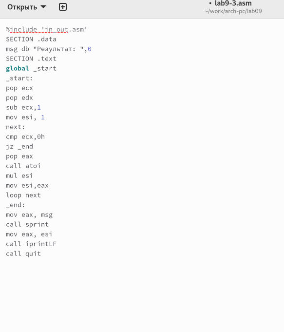{ #fig:014 width=70% }

Проверим работу программы lab9-3.asm. (рис. [-@fig:015])

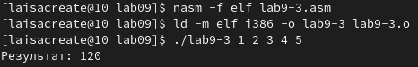{ #fig:015 width=70% }

# Самостоятельная работа 

Напишем программу, которая находит сумму занчений функций f(x) для x=x1,x2,…,xn. Программа будет выводить значение f(x1)+f(x2)+…+f(xn). Моя функция f(x) = 6x + 13. (рис. 2.16) (рис. [-@fig:016])

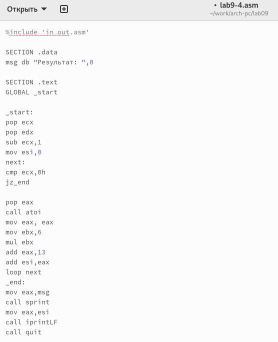{ #fig:016 width=70% }

Программа работает верно и выдает верное значение, то есть задание выполнено верно. (рис. [-@fig:017])

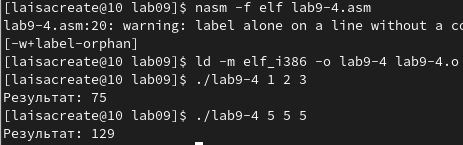{ #fig:017 width=70% }

# Выводы

В ходе выполнения данной лабораторной работы я приобрела навыки написания программ с использованием циклов и обработкой аргументов командной
строки.

