---
## Front matter
title: "Отчет по лабораторной работе №10"
subtitle: "Архитектура компьютера"
author: "Попова Елизавета Сергеевна"

## Generic otions
lang: ru-RU
toc-title: "Содержание"

## Bibliography
bibliography: bib/cite.bib
csl: pandoc/csl/gost-r-7-0-5-2008-numeric.csl

## Pdf output format
toc: true # Table of contents
toc-depth: 2
lof: true # List of figures
lot: true # List of tables
fontsize: 12pt
linestretch: 1.5
papersize: a4
documentclass: scrreprt
## I18n polyglossia
polyglossia-lang:
  name: russian
  options:
	- spelling=modern
	- babelshorthands=true
polyglossia-otherlangs:
  name: english
## I18n babel
babel-lang: russian
babel-otherlangs: english
## Fonts
mainfont: PT Serif
romanfont: PT Serif
sansfont: PT Sans
monofont: PT Mono
mainfontoptions: Ligatures=TeX
romanfontoptions: Ligatures=TeX
sansfontoptions: Ligatures=TeX,Scale=MatchLowercase
monofontoptions: Scale=MatchLowercase,Scale=0.9
## Biblatex
biblatex: true
biblio-style: "gost-numeric"
biblatexoptions:
  - parentracker=true
  - backend=biber
  - hyperref=auto
  - language=auto
  - autolang=other*
  - citestyle=gost-numeric
## Pandoc-crossref LaTeX customization
figureTitle: "Рис."
tableTitle: "Таблица"
listingTitle: "Листинг"
lofTitle: "Список иллюстраций"
lotTitle: "Список таблиц"
lolTitle: "Листинги"
## Misc options
indent: true
header-includes:
  - \usepackage{indentfirst}
  - \usepackage{float} # keep figures where there are in the text
  - \floatplacement{figure}{H} # keep figures where there are in the text
---

# Цель работы

Приобретение навыков написания программ с использованием подпрограмм.
Знакомство с методами отладки при помощи GDB и его основными возможностями.

# Задание

1. Реализовать подпрограммы в NASM.
2. Выполнить отладку программам с помощью GDB.
3. Отработать добавление точек останова.
4. Поработа с данными программы в GDB.
5. Отработать обработку аргументов командной строки в GDB.
6. Выполнить задание для самостоятельной работы.

# Выполнение лабораторной работы

Создаем каталог для выполнения лабораторной работы № 10, переходим в него и создаем файл lab10-1.asm: (рис. [-@fig:001])

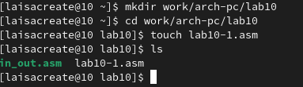{ #fig:001 width=70% }

В качестве примера рассмотрим программу вычисления арифметического выражения f(x) = 2x + 7 с помощью подпрограммы _calcul. В данном примере x вводится с клавиатуры, а само выражение вычисляется в подпрограмме. Внимательно изучим текст программы (Листинг 10.1). Введем в файл lab10-1.asm текст программы из листинга 10.1 (рис. [-@fig:002]). Создадим исполняемый файл и проверим его работу (рис. [-@fig:003]).

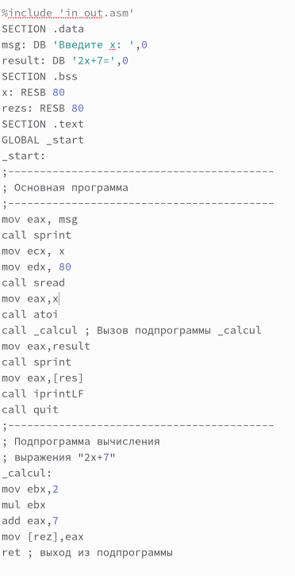{ #fig:002 width=70% }

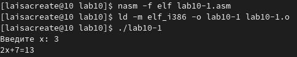{ #fig:003 width=70% }

Изменим текст программы, добавив подпрограмму _subcalcul в подпрограмму _calcul, для вычисления выражения f(g(x)), где x вводится с клавиатуры, f(x) = 2x + 7, g(x) = 3x − 1. Т.е. x передается в подпрограмму _calcul из нее в подпрограмму _subcalcul, где вычисляется выражение g(x), результат возвращается в _calcul и 8 вычисляется выражение f(g(x)). Результат возвращается в основную программу для вывода результата на экран (рис. [-@fig:004]),(рис. [-@fig:005]).

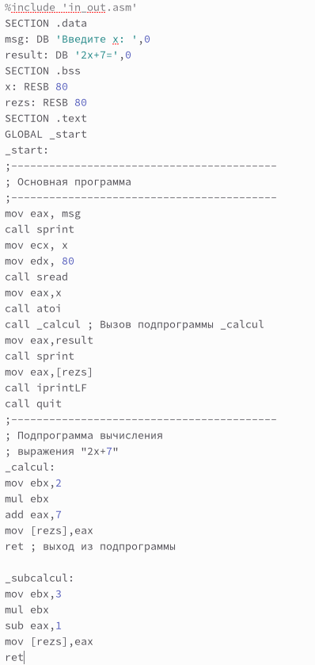{ #fig:004 width=70% }

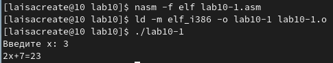{ #fig:005 width=70% }

Создадим файл lab10-2.asm с текстом программы из Листинга 10.2. (Программа печати сообщения Hello world!): (рис. [-@fig:006]),(рис. [-@fig:008]).

{ #fig:006 width=70% }

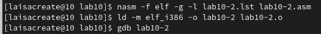{ #fig:008 width=70% }

Получаем исполняемый файл. Для работы с GDB в исполняемый файл добавляем отладочную информацию, для этого трансляцию программ провели с ключом ‘-g’.Загружаем исполняемый файл в отладчик gdb (рис. [-@fig:007]).

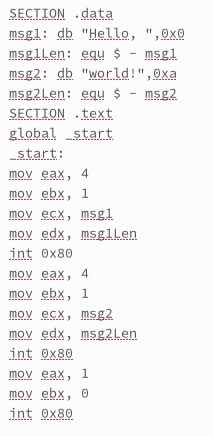{ #fig:007 width=70% }

Загружаем исполняемый файл в отладчик gdb. Проверяем работу программы, запустив ее в оболочке GDB с помощью команды run: (рис. [-@fig:009]).

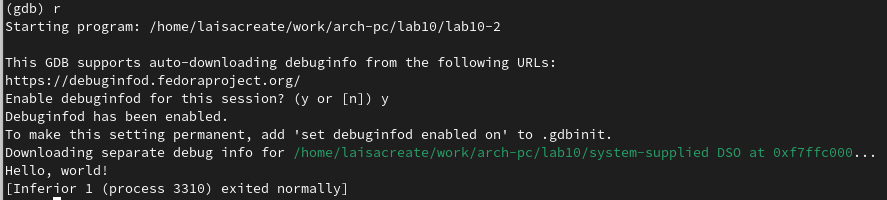{ #fig:009 width=70% }

Для более подробного анализа программы установим брейкпоинт на метку _start, с которой начинается выполнение любой ассемблерной программы, и запустим её (рис. [-@fig:010]).

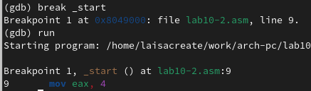{ #fig:010 width=70% }

Посмотрим дисассимилированный код программы с помощью команды disassemble начиная с метки _start (рис. [-@fig:011]).

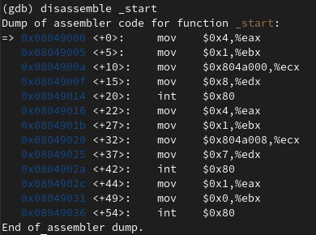{ #fig:011 width=70% }

Переключимся на отображение команд с Intel’овским синтаксисом, введя команду set disassembly-flavor intel. (рис. [-@fig:012])

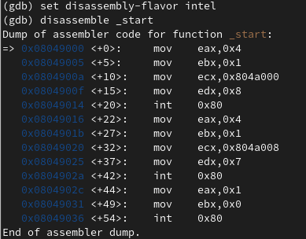{ #fig:012 width=70% }

Различия отображения синтаксиса машинных команд в режимах ATT и Intel: в АТТ перед адресом регистра ставится $, а перед названием регистра %, сначала записывается адрес, а потом - регистр. В Intel сначала регистр, а потом адрес, и перед ними ничего не ставится. Включим режим псевдографики для более удобного анализа программы(рис. [-@fig:013]).

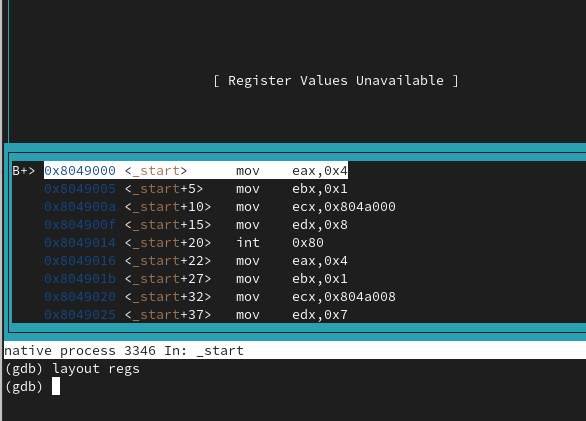{ #fig:013 width=70% }

Установить точку останова можно командой break (кратко b). Типичный аргумент этой команды — место установки. Его можно задать или как номер строки программы (имеет смысл, если есть исходный файл, а программа компилировалась с информацией об отладке), или как имя метки, или как адрес. Чтобы не было путаницы с номерами, перед адресом ставится «звёздочка»: На предыдущих шагах была установлена точка останова по имени метки (_start). Проверим это с помощью команды info breakpoints (кратко i b).  Установим еще одну точку останова по адресу инструкции. Адрес инструкции увидем в средней части экрана в левом столбце соответствующей инструкции. Определим адрес предпоследней инструкции (mov ebx,0x0) и установим точку останова (рис. [-@fig:014]).

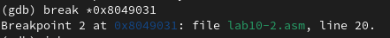{ #fig:014 width=70% }

Посмотрим информацию о всех установленных точках останова: (рис. [-@fig:015])

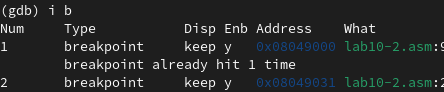{ #fig:015 width=70% }

Отладчик может показывать содержимое ячеек памяти и регистров, а при необходимости позволяет вручную изменять значения регистров и переменных. Выполнили 5 инструкций с помощью команды stepi (или si) и проследили за изменением значений регистров (рис. [-@fig:016]), (рис. [-@fig:017]).

{ #fig:016 width=70% }

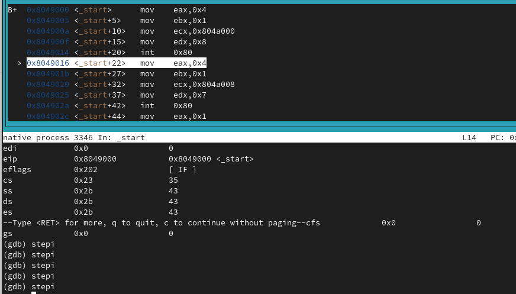{ #fig:017 width=70% }

Изменяются значения регистров: eax, ecx, edx, ebx. Посмотрим содержимое регистров с помощью команды info registers (или i r) (рис. [-@fig:018]).

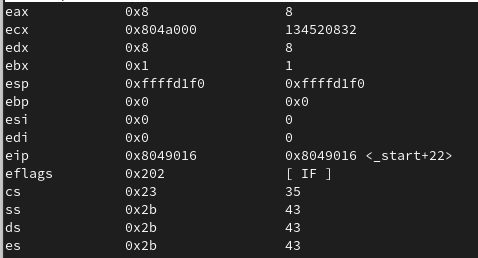{ #fig:018 width=70% }

Для отображения содержимого памяти можно использовать команду x, которая выдаёт содержимое ячейки памяти по указанному адресу. Формат, в котором выводятся данные, можно задать после имени команды через косую черту: x/NFU. С помощью команды x & также можно посмотреть содержимое переменной. Посмотрим значение переменной msg1 по имени. (рис. [-@fig:019])

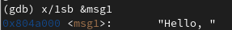{ #fig:019 width=70% }

Посмотрим значение переменной msg2 по адресу. Адрес переменной определим по дизассемблированной инструкции. Посмотрим инструкцию mov ecx,msg2 которая записывает в регистр ecx адрес перемененной msg2 (рис. [-@fig:020]).

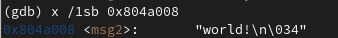{ #fig:020 width=70% }

Изменим значение для регистра или ячейки памяти можно с помощью команды set, задав ей в качестве аргумента имя регистра или адрес. При этом перед именем регистра ставится префикс $, а перед адресом нужно указать в фигурных
скобках тип данных. Изменим первый символ переменной msg1 (рис. [-@fig:021])

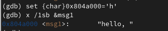{ #fig:021 width=70% }

Замените первый символ во второй переменной msg2 (рис. [-@fig:022]).

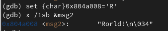{ #fig:022 width=70% }

Чтобы посмотреть значения регистров используется команда print /F. Выведем в различных форматах (в шестнадцатеричном формате, в двоичном формате и в символьном виде) значение регистра edx (рис. [-@fig:023]).

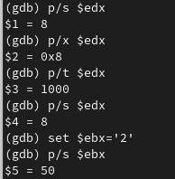{ #fig:023 width=70% }

С помощью команды set изменим значение регистра ebx. Разница вывода комманд p/s $ebx: (рис. [-@fig:024]).

{ #fig:024 width=70% }

Завершим выполнение программы с помощью команды continue (сокращенно c) и выйдем из GDB с помощью команды quit (сокращенно q) (рис. [-@fig:025]), (рис. [-@fig:026]).

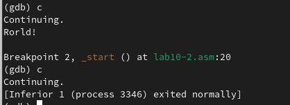{ #fig:025 width=70% }

{ #fig:026 width=70% }

Скопируем файл lab9-2.asm, созданный при выполнении лабораторной работы №9, с программой выводящей на экран аргументы командной строки (Листинг 9.2) в файл с именем lab10-3.asm: (рис. [-@fig:027])

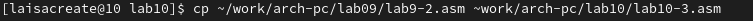{ #fig:027 width=70% }

Создадим исполняемый файл (рис. [-@fig:028]).

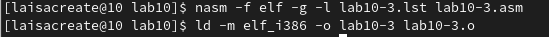{ #fig:028 width=70% }

Для загрузки в gdb программы с аргументами используем ключ–args. Загрузим исполняемый файл в отладчик, указав аргументы:(рис. [-@fig:029]).

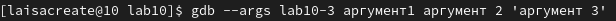{ #fig:029 width=70% }

Как отмечалось в предыдущей лабораторной работе, при запуске программы аргументы командной строки загружаются в стек. Исследуем расположение аргументов командной строки в стеке после запуска программы с помощью gdb. Для начала установим точку старта перед первой инструкцией в программе и запустим ее.(рис. [-@fig:030])

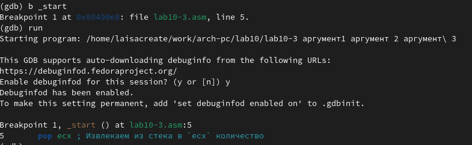{ #fig:030 width=70% }

Адрес вершины стека храниться в регистре esp и по этому адресу располагается число равное количеству аргументов командной строки (включая имя программы):(рис. [-@fig:031])

{ #fig:031 width=70% }

Как видно, число аргументов равно 5 – это имя программы lab10-3 и непосредственно аргументы: аргумент1, аргумент, 2 и ‘аргумент 3’. Посмотрим остальные позиции стека – по адесу [esp+4] располагается адрес в памяти где находится имя программы, по адесу [esp+8] хранится адрес первого аргумента, по аресу [esp+12] – второго и т.д. (рис. [-@fig:032])

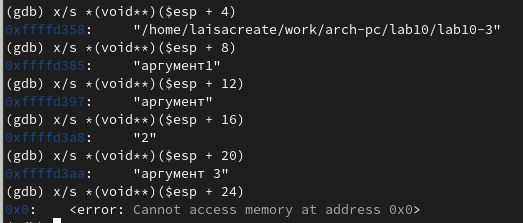{ #fig:032 width=70% }

# Задание для самостоятельной работы

Преобразуем программу из лабораторной работы №9 (Задание №1 для самостоятельной работы), реализовав вычисление значения функции f(x) как подпрограмму (рис. [-@fig:033]), (рис. [-@fig:034]).

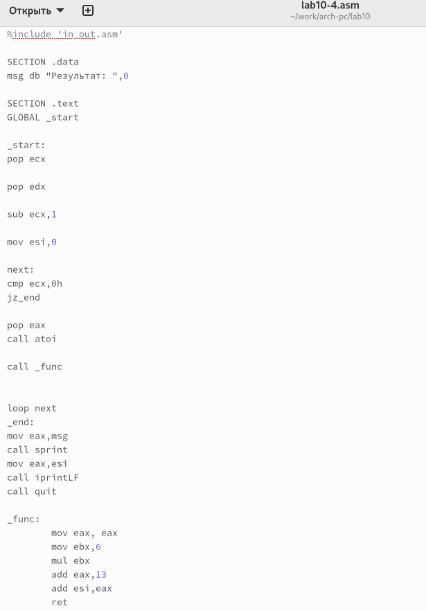{ #fig:033 width=70% }

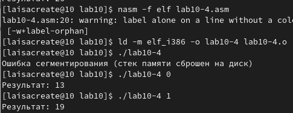{ #fig:034 width=70% }

В листинге 10.3 приведена программа вычисления выражения (3 + 2) * 4 + 5. Создаем файл (рис. [-@fig:035]), запишем код листинга (рис. [-@fig:036]), создадим исполняющий файл (рис. [-@fig:037]), при запуске обнаружим вывод неверного результата (рис. [-@fig:038]).

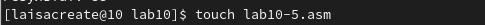{ #fig:035 width=70% }

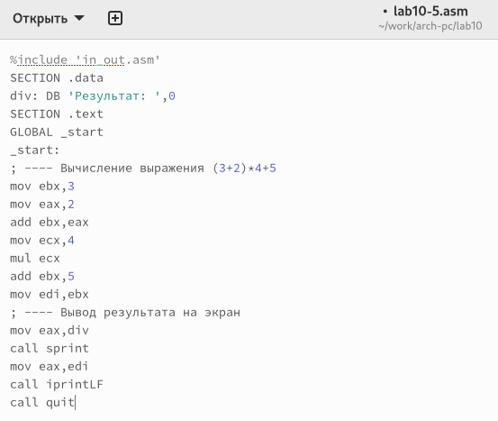{ #fig:036 width=70% }

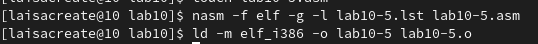{ #fig:037 width=70% }

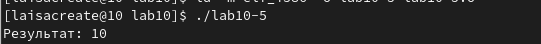{ #fig:038 width=70% }

Запустим файл в отладчике GDB (рис. [-@fig:039]), установим точку останова (рис. [-@fig:040]), запустим код (рис. [-@fig:041]), включим режим псевдографики (рис. [-@fig:042]), пошагово пройдем все строчки кода (рис. [-@fig:043]), (рис. [-@fig:044]), (рис. [-@fig:045]), (рис. [-@fig:046]), (рис. [-@fig:047]), (рис. [-@fig:048]), (рис. [-@fig:049]), (рис. [-@fig:050]). Обнаружили ошибку: вместо регистра ebx на 4 умножался eax, а 5 прибавлялась не к произведению, а только к ebx, исправим её (рис. [-@fig:051]), проверим результат работы программы (рис. [-@fig:052]).

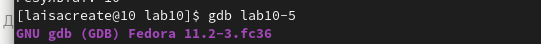{ #fig:039 width=70% }

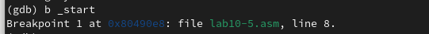{ #fig:040 width=70% }

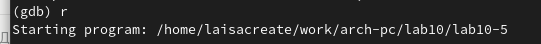{ #fig:041 width=70% }

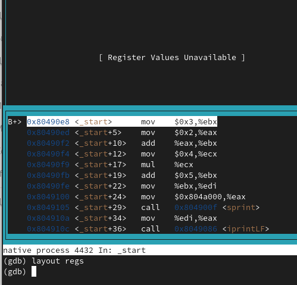{ #fig:042 width=70% }

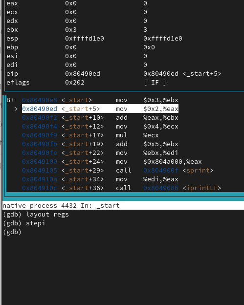{ #fig:043 width=70% }

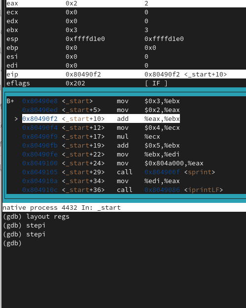{ #fig:044 width=70% }

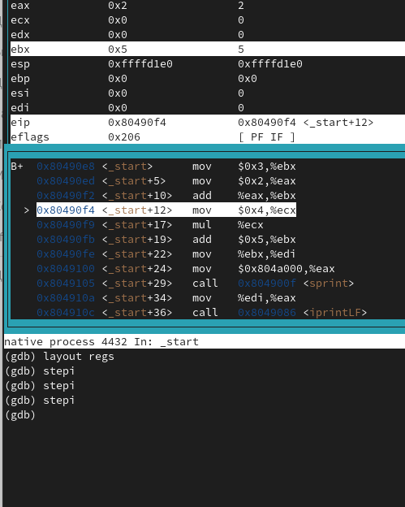{ #fig:045 width=70% }

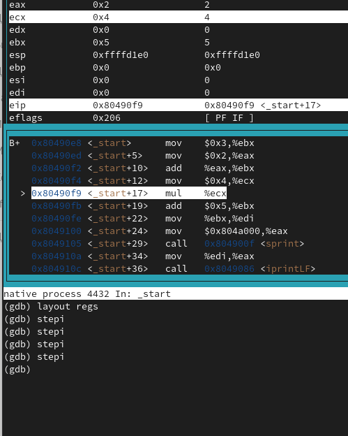{ #fig:046 width=70% }

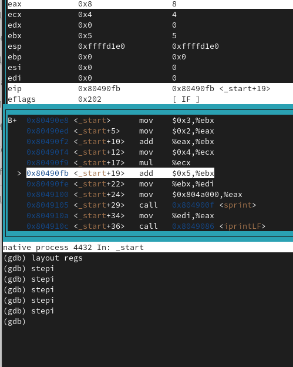{ #fig:047 width=70% }

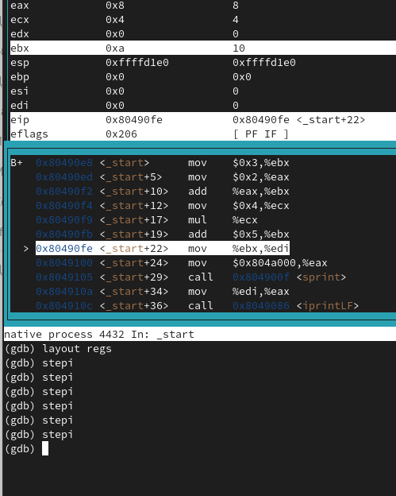{ #fig:048 width=70% }

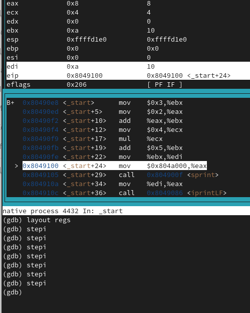{ #fig:049 width=70% }

{ #fig:050 width=70% }

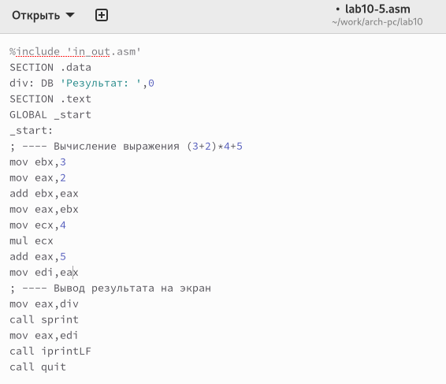{ #fig:051 width=70% }

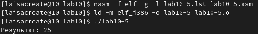{ #fig:052 width=70% }

# Выводы

В ходе выполнения лабораторной работы были приобретены навыки написания программ с использованием подпрограмм, ознакомились с методами отладки при помощи GDB и его основными возможностями

