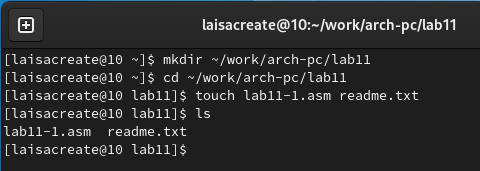
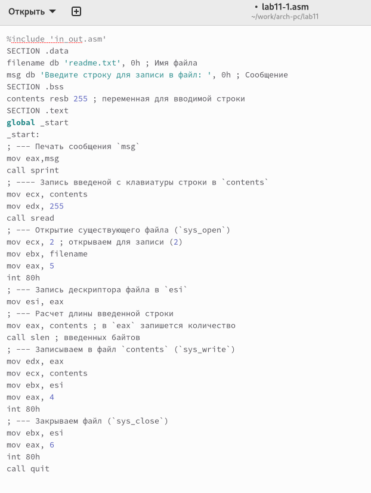
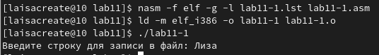
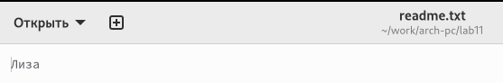
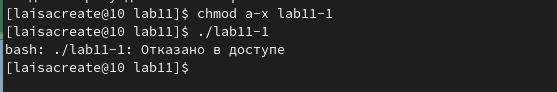
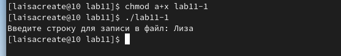
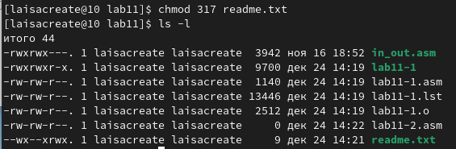
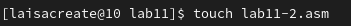
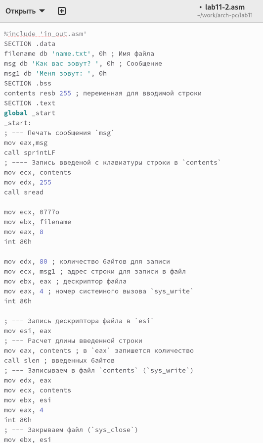
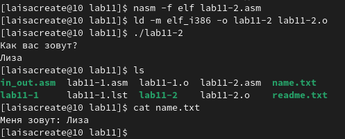

---
## Front matter
title: "Отчет по лабораторной работе №11"
subtitle: "Архитектура компьютера"
author: "Попова Елизавета Сергеевна"

## Generic otions
lang: ru-RU
toc-title: "Содержание"

## Bibliography
bibliography: bib/cite.bib
csl: pandoc/csl/gost-r-7-0-5-2008-numeric.csl

## Pdf output format
toc: true # Table of contents
toc-depth: 2
lof: true # List of figures
lot: true # List of tables
fontsize: 12pt
linestretch: 1.5
papersize: a4
documentclass: scrreprt
## I18n polyglossia
polyglossia-lang:
  name: russian
  options:
	- spelling=modern
	- babelshorthands=true
polyglossia-otherlangs:
  name: english
## I18n babel
babel-lang: russian
babel-otherlangs: english
## Fonts
mainfont: PT Serif
romanfont: PT Serif
sansfont: PT Sans
monofont: PT Mono
mainfontoptions: Ligatures=TeX
romanfontoptions: Ligatures=TeX
sansfontoptions: Ligatures=TeX,Scale=MatchLowercase
monofontoptions: Scale=MatchLowercase,Scale=0.9
## Biblatex
biblatex: true
biblio-style: "gost-numeric"
biblatexoptions:
  - parentracker=true
  - backend=biber
  - hyperref=auto
  - language=auto
  - autolang=other*
  - citestyle=gost-numeric
## Pandoc-crossref LaTeX customization
figureTitle: "Рис."
listingTitle: "Листинг"
lofTitle: "Список иллюстраций"
## Misc options
indent: true
header-includes:
  - \usepackage{indentfirst}
  - \usepackage{float} # keep figures where there are in the text
  - \floatplacement{figure}{H} # keep figures where there are in the text
---

# Цель работы

Приобретение навыков написания программ для работы с файлами.

# Задание

1. Отработать запись данных в файл.
2. Отработать изменение прав доступа к файлам.
3. Выполнить задание для самостоятельной работы.

# Выполнение лабораторной работы

Создаем каталог для программам лабораторной работы № 11, перешли в него и создали файл lab11-1.asm и readme.txt (рис. [-@fig:001])

{ #fig:001 width=70% }

Вводим в файл lab11-1.asm текст программы из листинга 11.1 (Программа записи в файл сообщения). Создаем исполняемый файл и проверяем его работу (рис. [-@fig:002]), (рис. [-@fig:003]), (рис. [-@fig:004]).

{ #fig:002 width=70% }

{ #fig:003 width=70% }

{ #fig:004 width=70% }

С помощью команды chmod изменяем права доступа к исполняемому файлу lab11-1, запретив его выполнение. Пытаемся выполнить файл и получаем следующий результат, так как выполнение файла ограничено (рис. [-@fig:005]).

{ #fig:005 width=70% }

С помощью команды chmod изменяем права доступа к файлу lab11-1.asm с исходным текстом программы, добавив права на исполнение. Выполняем его, так как вернули права на исполнение (рис. [-@fig:006]).

{ #fig:006 width=70% }

Предоставляем права доступа к файлу readme.txt в соответствии с 15 вариантом в таблице 11.4.рис. Проверяем правильность выполнения с помощью команды ls -l (рис. [-@fig:007]).

{ #fig:007 width=70% }

# Выполнение самостоятельной работы

Напишем программу, работающую по следующему алгоритму:
• вывод приглашения “Как Вас зовут?”
• ввести с клавиатуры имя
• создать файл с именем name.txt
• записать в файл сообщение “Меня зовут”
• дописать в файл строку введенную с клавиатуры
• закрыть файл
(рис. [-@fig:008]), (рис. [-@fig:009]).

{ #fig:008 width=70% }

{ #fig:009 width=70% }

Создадим исполняемый файл и проверим его работу. Проверим наличие файла и его содержимое с помощью команд ls и cat (рис. [-@fig:010]).

{ #fig:010 width=70% }

# Выводы

В ходе выполнения лабораторной работы были приобретены навыки написания программ для работы с файлами
